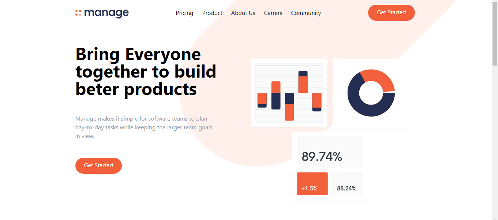

# A responsive landing page built with tailwind-css

## An overview of the project
- The aim of the project is to help me in mastering tailwind-css while watching [Brad Traversy](https://github.com/bradtraversy) course under tailwind-css. [live site](https://633213170ffd1e0dbb4fd531--kingsley-tailwind-landingpage.netlify.app/)

<P>
    
</p>

## To Run this Project

```js

    1. You should have node js installed on your local machine
    2. Run npm install (To install all the depencies used for the project)

```